# VzEkC Verlosung – Benutzerhandbuch

## Was ist das Verlosungssystem?

Das Verlosungssystem ermöglicht es Vereinsmitgliedern, Hardware-Spenden transparent und fair zu verlosen. Jede Verlosung besteht aus mehreren Paketen, für die Teilnehmer Lose kaufen können. Nach Ablauf der Frist werden die Gewinner durch einen nachvollziehbaren, deterministischen Zufallsalgorithmus ermittelt.

---

## Als Teilnehmer

### Verlosungen finden

Aktive Verlosungen werden in der konfigurierten Verlosungs-Kategorie angezeigt. Der Beitragstitel zeigt den Namen der Verlosung, und ein spezielles Widget am Anfang des Beitrags fasst den aktuellen Status zusammen.

Das Status-Widget zeigt:
- Den aktuellen Zustand (Aktiv, Beendet, Gewinner gezogen)
- Die verbleibende Zeit bis zum Ende der Verlosung
- Wie viele Pakete verlost werden
- Schaltflächen für verfügbare Aktionen

### Lose kaufen

Um an einer Verlosung teilzunehmen, scrollst du zum gewünschten Paket im Beitrag. Jedes Paket ist als separater Beitrag angelegt und zeigt eine Beschreibung sowie Fotos der enthaltenen Hardware.

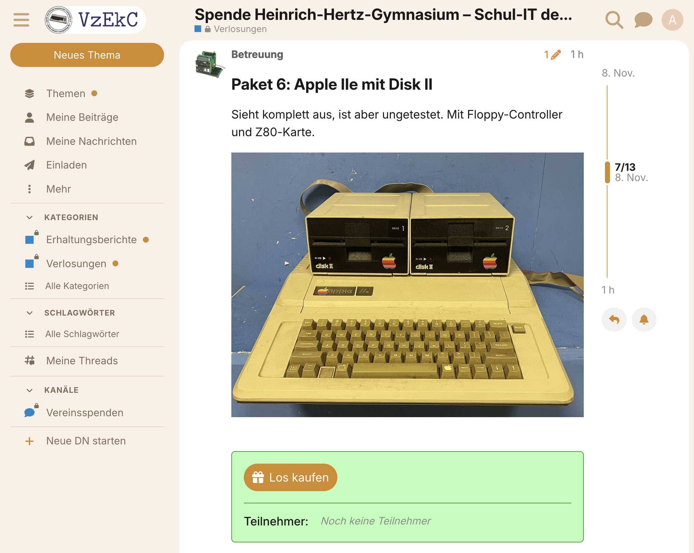

Unter jedem Paket findest du einen "Los kaufen" Button sowie die aktuelle Anzahl der verkauften Lose. Du kannst pro Paket genau ein Los kaufen. Die Teilnehmerliste zeigt alle Nutzer, die für dieses Paket ein Los gekauft haben. Diese Liste ist für alle Mitglieder sichtbar.

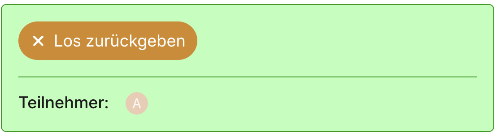

Solange die Verlosung läuft, kannst du das Los über den Button "Los zurückgeben" zurückgeben.

### Gewinnbenachrichtigung

Wenn die Verlosung endet und die Gewinner gezogen wurden, erhältst du automatisch eine persönliche Nachricht, falls du gewonnen hast. Die Nachricht enthält Details zu deinem Gewinn sowie Informationen zur Übergabe.

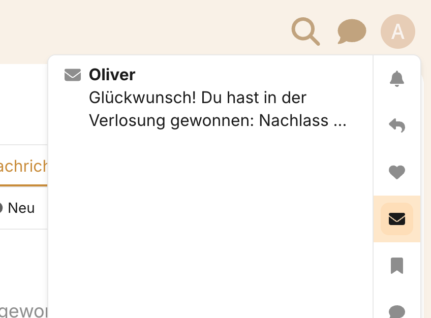

Zusätzlich wird im Verlosungsbeitrag selbst angezeigt, wer welches Paket gewonnen hat. Neben dem Gewinnernamen erscheint ein Avatar.

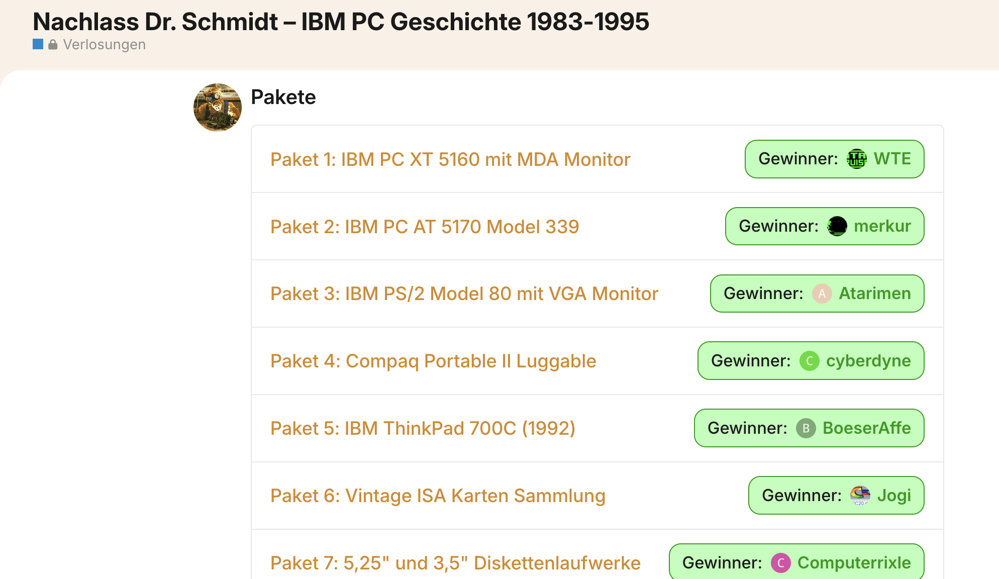

### Abholung oder Versand vereinbaren

Antworte auf die Gewinnernachricht des Verlosungserstellers, um die Übergabe zu vereinbaren. Die Nachricht sowie der Hauptbeitrag der Verlosung enthalten alle wichtigen Informationen zu Abholung, Versand und Fristen. Sobald du das Paket erhalten hast, markiert der Ersteller es als "Erhalten".

### Erhaltungsbericht schreiben

Nachdem du das Paket erhalten hast, bist du verpflichtet, einen Erhaltungsbericht zu schreiben. Du erhältst wöchentliche Erinnerungen per persönlicher Nachricht, bis du den Bericht verfasst hast.

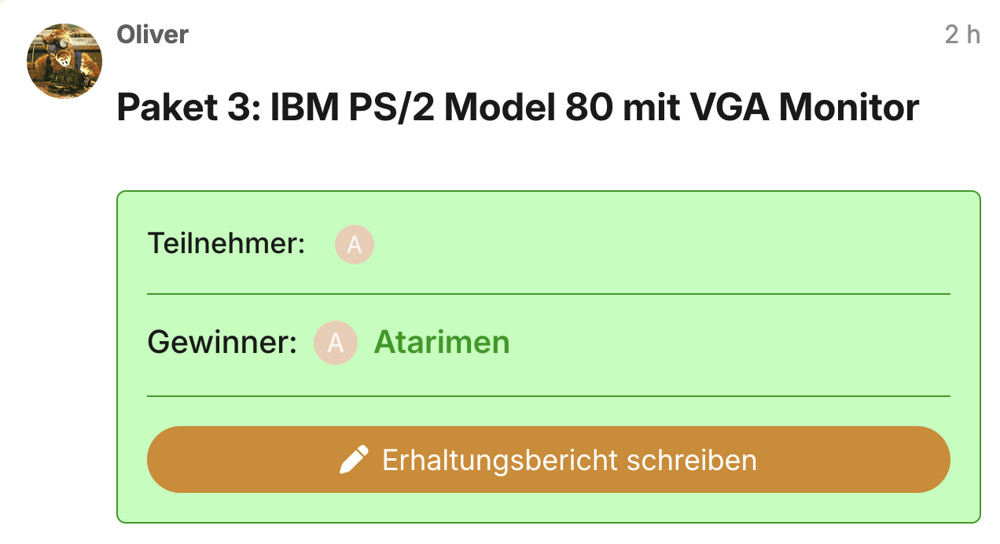

Klicke auf den "Erhaltungsbericht schreiben" Button am Paket-Beitrag. Ein vorausgefülltes Formular öffnet sich, in dem du beschreibst:
- Was im Paket enthalten war
- Den Zustand der Hardware
- Deine ersten Eindrücke
- Fotos der erhaltenen Gegenstände
- Deine Pläne für die Hardware (Sammlung, Restaurierung, Nutzung)

Der Erhaltungsbericht wird automatisch in der konfigurierten Erhaltungsberichte-Kategorie veröffentlicht und mit dem ursprünglichen Paket verknüpft.

---

## Als Verlosungsersteller

### Verlosung erstellen

Um eine neue Verlosung zu erstellen, klickst du auf den "Neue Verlosung" Button, der in der konfigurierten Verlosungs-Kategorie erscheint.

Es öffnet sich ein Formular, in dem du die Grunddaten für die Verlosung eingibst. Das Formular erstellt die Grundstruktur der Verlosung im Entwurfsmodus. Anschließend fügst du durch Bearbeiten der einzelnen Beiträge die detaillierten Beschreibungen und Fotos hinzu. Erst wenn alle Details eingegeben sind, veröffentlichst du die Verlosung und machst sie dadurch für alle Mitglieder sichtbar.

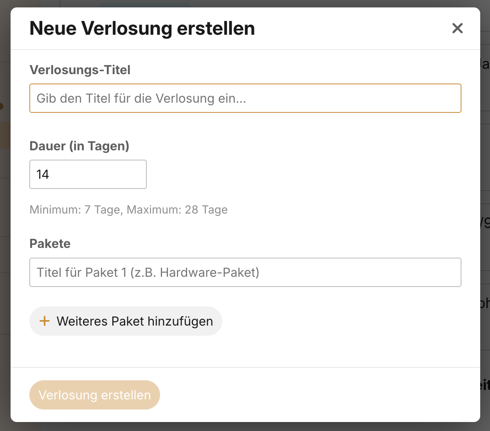

Im Formular gibst du folgende Informationen ein:

**Titel:** Gib einen aussagekräftigen Titel für die Verlosung ein (z.B. "Spende von Mitglied XY – Retro-Computer und Zubehör").

**Laufzeit:** Lege die Laufzeit fest. Die Standardlaufzeit beträgt 14 Tage und sollte nur aus wichtigem Grund geändert werden (möglich sind 7-28 Tage).

**Pakete:** Füge die einzelnen Pakete hinzu, die verlost werden sollen. Gib für jedes Paket einen aussagekräftigen Titel ein (z.B. "Amiga 500 mit Zubehör" oder "Commodore 64 Bundle"). Du kannst beliebig viele Pakete hinzufügen oder auch welche wieder entfernen.

Wenn alles eingetragen ist, klicke auf "Verlosung erstellen". Die Verlosung wird als Entwurf angelegt und es werden automatisch Beiträge für die Einleitung und jedes Paket erstellt.

### Details hinzufügen

Nach der Erstellung befindet sich die Verlosung im Entwurfsmodus. Nur du und Administratoren können sie sehen. Jetzt fügst du die detaillierten Informationen hinzu:

**Hauptbeitrag bearbeiten:** Ergänze die Beschreibung der Verlosung mit allen wichtigen Informationen zur Herkunft der Spende und zur Übergabe der Pakete.

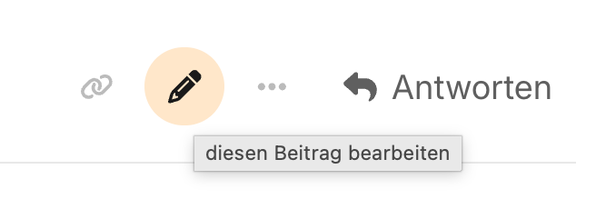

Der Hauptbeitrag sollte folgende Struktur haben:

**1. Über diese Verlosung**

Beschreibe die Herkunft der Spende:
- Von wem stammt die Spende? (z.B. Firma, privater Sammler, Nachlass, Schule)
- Welche Geschichte hat die Spende?
- Wo und wie hast du die Spende abgeholt?

Beispiel: "Diese Hardware stammt aus der Liquidation der Firma **TechnoData GmbH** aus Köln, die Ende der 1990er Jahre im Bereich CAD-Systeme tätig war. Der ehemalige Geschäftsführer hat uns die komplette Ausstattung gespendet. Ich habe alle Systeme in Köln abgeholt."

**2. Behaltenes System**

Falls du EIN System oder Teil aus der Spende für dich behalten hast, beschreibe es hier. Nur ein System darf behalten werden!

Beispiel: "Aus der Spende habe ich einen Commodore Amiga 1200 für mich behalten – ein System, das ich schon seit meiner Jugend haben wollte."

**3. Übergabe der Pakete**

Beschreibe die Übergabemöglichkeiten mit konkreten Angaben:

**Wo hast du abgeholt?** "Ich habe alle Systeme in [Stadt] abgeholt."

**Abholung:** Gib eine konkrete Adresse mit Postleitzahl an, wo Gewinner die Pakete abholen können (z.B. "Die Pakete können in 50823 Köln-Ehrenfeld abgeholt werden"). Erwähne auch, ob du auf lokalen Treffen bist.

**Versand:** Erkläre, ob Versand möglich ist:
- Versandkosten trägt IMMER der Gewinner
- Ob du Verpackungsmaterial hast oder der Gewinner welches zusenden kann
- Ob schwere Systeme (Monitore, Desktop-Gehäuse) abgeholt werden sollten

**Fristen:** Gib klare Fristen an:
- Versand: innerhalb von 1-2 Wochen nach Kontaktaufnahme
- Abholung: innerhalb von 6-12 Wochen nach der Ziehung
- Was passiert mit nicht abgeholten Paketen? (entweder: "kommen in eine neue Verlosung" oder "behalte ich")

WICHTIG: Gib KEINE Frist für die Kontaktaufnahme an – Gewinner können sich in ihrem eigenen Tempo melden.

**Paket-Beiträge bearbeiten:** Jedes Paket hat einen eigenen Beitrag. Bearbeite jeden Beitrag und füge eine detaillierte Beschreibung hinzu. Liste alle enthaltenen Gegenstände auf, beschreibe deren Zustand und füge aussagekräftige Fotos hinzu. Gute Fotos und genaue Beschreibungen erhöhen das Interesse der Teilnehmer.

### Verlosung veröffentlichen

Sobald du alle Beschreibungen und Fotos hinzugefügt hast, überprüfe noch einmal alle Details. Das Status-Widget zeigt einen "Verlosung veröffentlichen" Button.

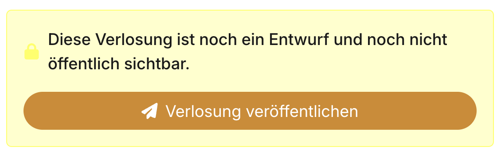

Wenn du die Verlosung veröffentlichst, wird sie für alle Mitglieder sichtbar und die Laufzeit beginnt. Das Enddatum wird automatisch berechnet (heute + konfigurierte Laufzeit). Nach der Veröffentlichung können keine Pakete mehr hinzugefügt oder entfernt werden. Die Beschreibungen kannst du aber weiterhin bearbeiten.

### Verlosung beobachten

Während die Verlosung läuft, kannst du jederzeit den aktuellen Stand einsehen. Unter jedem Paket siehst du:
- Wie viele Lose verkauft wurden
- Welche Nutzer teilnehmen

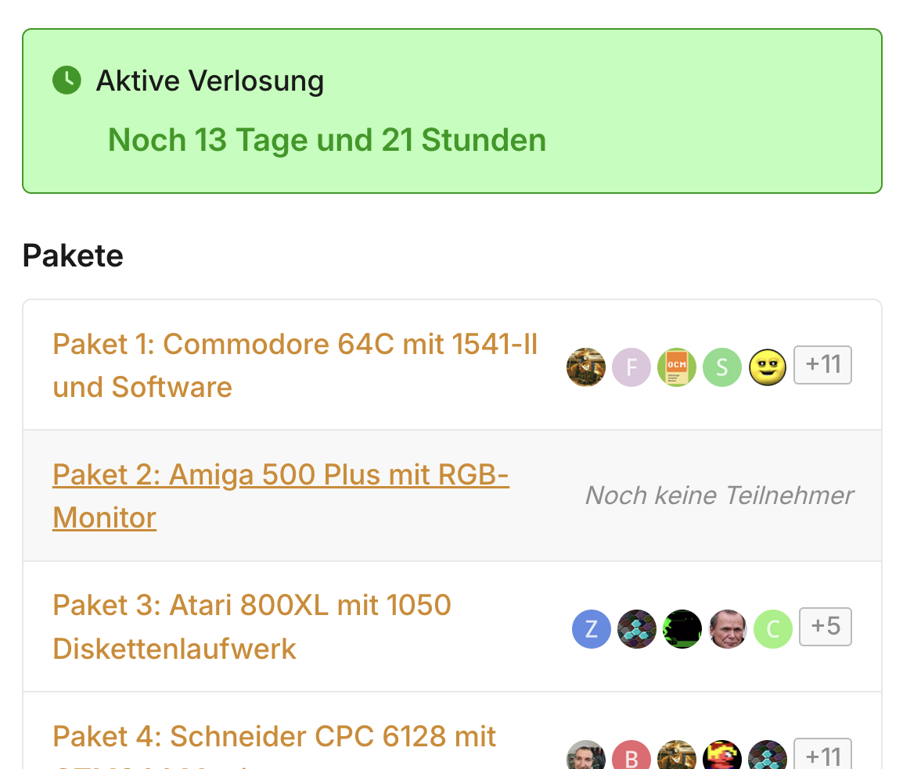

Das Status-Widget zeigt die verbleibende Zeit bis zum Ende. Du erhältst eine persönliche Nachricht, wenn die Verlosung morgen endet.

### Gewinner ziehen

Sobald die Verlosung beendet ist, erscheint ein "Gewinner ziehen" Button im Status-Widget. Nur du als Ersteller und Administratoren können die Ziehung durchführen.

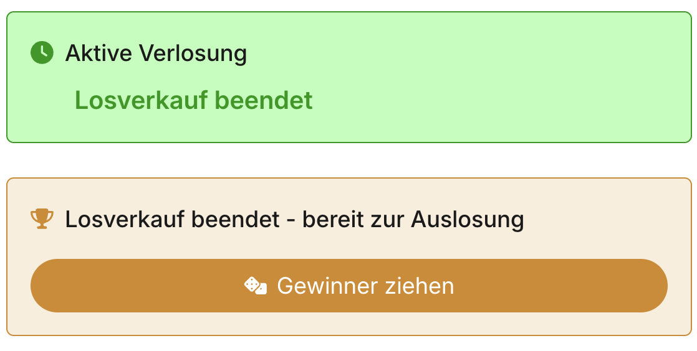

Beim Klick öffnet sich ein Modal, das die Pakete und deren Teilnehmer anzeigt. Klicke auf "Gewinner ziehen", um den deterministischen Ziehungsprozess zu starten. Der Algorithmus läuft im Browser und basiert auf:
- Dem Startzeitpunkt der Verlosung
- Allen Teilnehmernamen
- Einem kryptografischen Hash (SHA-512)

Nach dem Klick werden die Gewinner automatisch ermittelt, gespeichert und die Seite lädt neu. Der gleiche Prozess mit denselben Eingabedaten führt immer zum gleichen Ergebnis – die Ziehung ist somit nachvollziehbar und manipulationssicher. Alle Gewinner erhalten automatisch eine persönliche Nachricht mit den Details.

### Pakete als erhalten markieren

Nachdem ein Gewinner sein Paket abgeholt oder per Post erhalten hat, solltest du das Paket als "Erhalten" markieren. Am Paket-Beitrag erscheint ein Button "Als erhalten markieren".

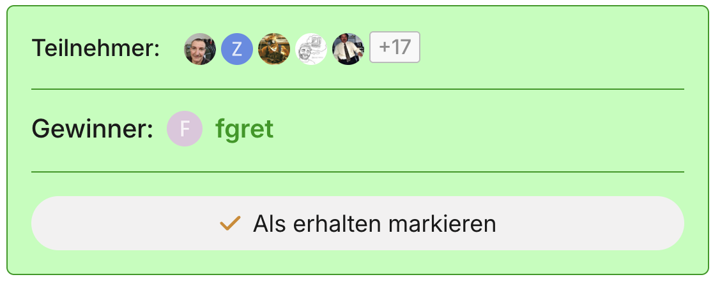

Nach dem Markieren wird das Übergabedatum gespeichert und der Status des Pakets aktualisiert. Dies ist wichtig, da das System basierend auf diesem Datum Erinnerungen für den Erhaltungsbericht verschickt.

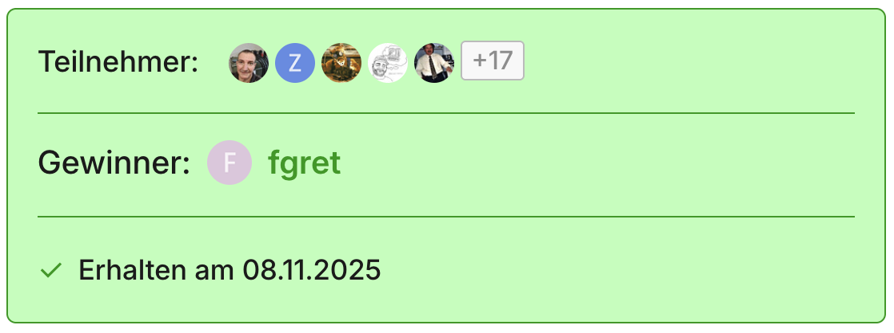

### Erinnerungen

Als Verlosungsersteller erhältst du automatische Erinnerungen per persönlicher Nachricht in folgenden Situationen:

**Unveröffentlichte Verlosung**: Täglich um die konfigurierte Uhrzeit, solange die Verlosung im Entwurfsmodus verbleibt.

**Beendete Verlosung ohne Ziehung**: Täglich um die konfigurierte Uhrzeit, solange die Verlosung beendet ist, aber die Gewinner noch nicht gezogen wurden.

**Verlosung endet morgen**: Einmal pro Tag um die konfigurierte Uhrzeit, wenn die Verlosung am nächsten Tag endet.

**Nicht erhaltene Pakete**: Wöchentlich (alle 7 Tage nach der Ziehung), solange Pakete noch nicht als erhalten markiert wurden. Die Nachricht listet alle betroffenen Pakete auf.

Diese Erinnerungen helfen dir, den Verlosungsprozess zeitnah abzuschließen und sicherzustellen, dass alle Gewinner ihre Pakete erhalten.

---

## Häufig gestellte Fragen

**Kann ich ein Los wieder zurückgeben?**
Ja, solange die Verlosung noch läuft, kannst du dein Los jederzeit zurückgeben. Der Button ändert sich nach dem Kauf von "Los kaufen" zu "Los zurückgeben".

**Kann ich Lose für mehrere Pakete kaufen?**
Ja, du kannst an beliebig vielen Paketen einer Verlosung teilnehmen. Jedes Paket wird unabhängig verlost.

**Kann ich mehrere Lose für dasselbe Paket kaufen?**
Nein, pro Paket kannst du genau ein Los kaufen. Alle Teilnehmer haben die gleiche Gewinnchance bei jedem Paket.

**Wie wird der Gewinner ermittelt?**
Der Gewinner wird durch einen deterministischen Zufallsalgorithmus ermittelt, der im Browser läuft. Der Seed basiert auf dem Startzeitpunkt und allen Teilnehmernamen. Dadurch ist das Ergebnis nachvollziehbar und kann nicht manipuliert werden.

**Kann ich als Ersteller an meiner eigenen Verlosung teilnehmen?**
Ja, das ist ausdrücklich erlaubt. Da der Ziehungsalgorithmus deterministisch ist und auf dem Startzeitpunkt sowie den Teilnehmernamen basiert, kann das Ergebnis nicht manipuliert werden – auch nicht durch den Ersteller selbst. Jeder Teilnehmer hat die gleiche faire Gewinnchance.

**Was passiert, wenn ein Gewinner sein Paket nicht abholt?**
Der Ersteller erhält wöchentliche Erinnerungen über nicht erhaltene Pakete. Was mit nicht abgeholten Paketen passiert, sollte bereits in der Verlosungsbeschreibung angegeben sein. Üblicherweise kommen sie entweder in eine neue Verlosung oder der Organisator behält sie für seine Sammlung.

**Muss ich wirklich einen Erhaltungsbericht schreiben?**
Ja, der Erhaltungsbericht ist eine Vereinspflicht. Er dokumentiert, was aus den gespendeten Gegenständen wurde, und motiviert Spender, weitere Hardware zu spenden. Du erhältst wöchentliche Erinnerungen, bis du den Bericht verfasst hast.

**Kann ich eine Verlosung nach der Veröffentlichung noch ändern?**
Du kannst die Beschreibungen der Beiträge weiterhin bearbeiten, aber keine Pakete mehr hinzufügen oder entfernen. Füge daher alle Pakete bereits beim Erstellen hinzu.

**Wie lange läuft eine Verlosung?**
Die Standardlaufzeit beträgt 14 Tage und sollte nur aus wichtigem Grund geändert werden. Möglich sind Laufzeiten zwischen 7 und 28 Tagen. Die Verlosung endet automatisch zum festgelegten Zeitpunkt.
